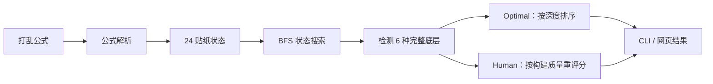

# 二阶魔方底层求解器

[English](README.en.md)


[](https://github.com/WandsgYu/2x2-first-layer-solver/actions/workflows/ci.yml)


一个用 TypeScript 实现的 2x2 魔方第一层求解与训练工具。输入打乱公式后，它会搜索 6 种底色的完整层解法，并同时提供追求最短步数的 **Optimal Mode** 和偏向人类构建思路的 **Human Mode**。

> 这个项目只求解一个完整层，不是完整二阶魔方还原器。

## 为什么做这个项目

“把底面四个贴纸变成同色”并不等于完成一层。真正完整的一层还要求四个角块的位置、朝向和相邻侧色全部正确。

这个项目把这个判断转成可验证的状态搜索问题：

- 用 24 个可见角贴纸编码二阶魔方状态；
- 解析标准 WCA 转动公式；
- 用 BFS 搜索不同底色的最短解；
- 对候选路径进行二次评分，生成更适合训练的步骤；
- 用测试验证转动方向、逆公式和最终解法。

## 两种求解模式

| 模式 | 目标 | 输出 |
| --- | --- | --- |
| Optimal Mode | 找到每种底色的最短解 | 六种底色结果，按步数排序 |
| Human Mode | 在接近最短的解中选择更自然的构建路径 | 每步目标、原因、提示与答案 |

Human Mode 会考虑换面次数、结构破坏、形成“条”、完成块增长和完整面形成等因素。它不是模拟专业 CFOP 教学，而是把可解释的结构信号加入路径排序。

## 求解流程



搜索使用 18 种基本面转，并剪枝连续转动同一个面的分支。默认最大深度为 8。

## 网页界面

```bash
git clone https://github.com/WandsgYu/2x2-first-layer-solver.git
cd 2x2-first-layer-solver
npm install
npm run dev
```

打开 [http://127.0.0.1:5173](http://127.0.0.1:5173)。

网页支持：

- 自动生成 8–10 步 `U / R / F` 风格打乱；
- 查看上一条和下一条公式；
- 用平面图显示打乱状态和每一步后的状态；
- 输出全部底色最短解；
- 用 Human Mode 逐步提问“下一步最应该做什么”；
- 在查看答案后解释该步的结构目标。

## 命令行

求一个最佳底层：

```bash
npm run solve -- "R U R' U' F2"
```

示例输出：

```text
底色：蓝色
步骤：U' F2 U
步数：3
完成效果：蓝色底层完整复原
```

输出全部底色：

```bash
npm run solve -- --all "U2 R2 F' U2 F2 U2 R F' U"
```

调整搜索深度：

```bash
npm run solve -- --max-depth 9 "R U R' U' F2"
```

## 坐标与配色

固定配色：

| 面 | 颜色 |
| --- | --- |
| `U` | 白色 |
| `D` | 黄色 |
| `F` | 绿色 |
| `B` | 蓝色 |
| `R` | 红色 |
| `L` | 橙色 |

求解时保持打乱后的外部坐标系不变。尝试不同目标底色时，不会重新转向整个魔方。

## 测试

```bash
npm test
```

自动化测试覆盖：

- WCA 公式解析和后缀处理；
- 单次转动四次回到原状态；
- 打乱公式与逆公式互相抵消；
- 最佳解和全部底色解的有效性；
- 解法按深度排序；
- `U / D` 转动方向回归；
- Human Mode 返回有效且带解释的完整层解法。

## 项目结构

```text
src/
├── alg.ts        # 公式解析、格式化与逆公式
├── cube.ts       # 状态模型、转动和完整层判断
├── solver.ts     # BFS 最短解搜索
├── human.ts      # 候选收集、评分和步骤解释
├── scramble.ts   # 打乱生成
├── cli.ts        # 命令行入口
└── web.ts        # 网页交互与可视化
test/             # 状态、求解和回归测试
```

## 实现边界

- 状态模型：24 个可见角贴纸。
- 搜索动作：`U D L R F B`，支持顺时针、逆时针和 180°。
- 默认 BFS 深度：8。
- Human Mode 在首个最短解附近继续收集有限候选，再进行启发式评分。
- 项目不会继续搜索完整二阶魔方解法。

## License

[MIT](LICENSE)
